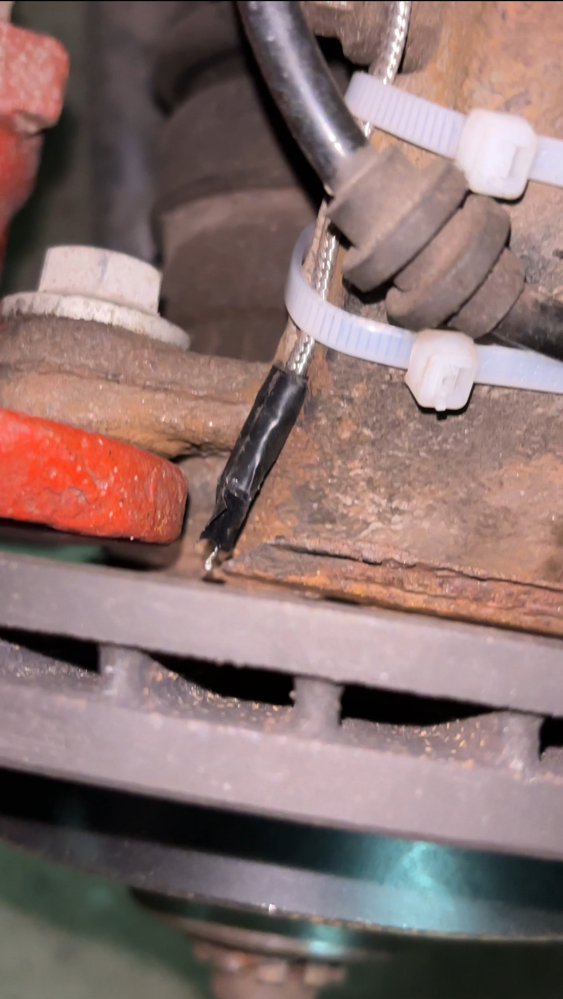
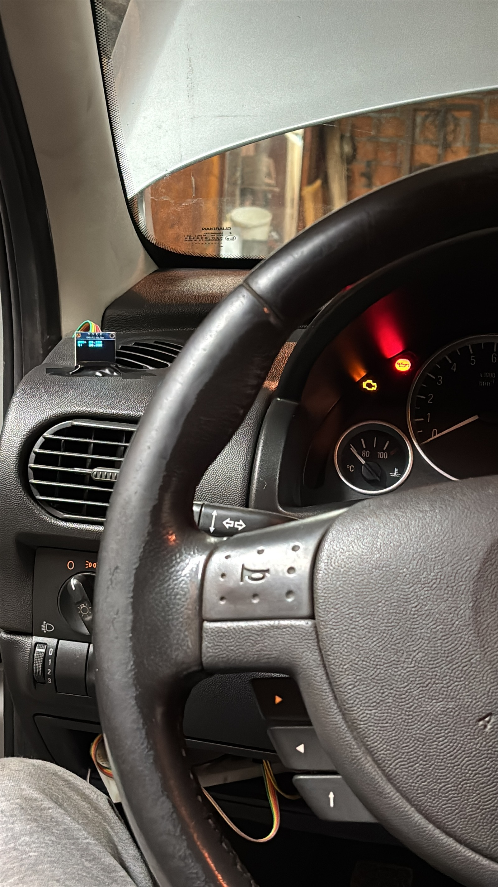
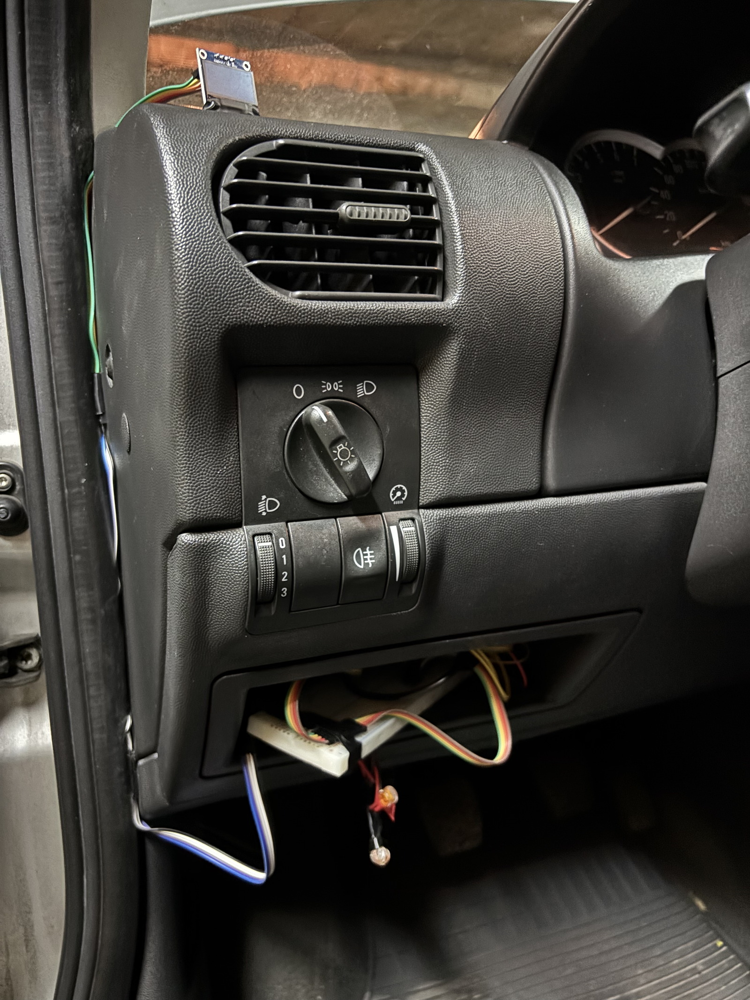

# ⚙️ Hardware Development Log

This document records the physical wiring, installation, and testing history of the **Brake Temperature Sensor System (BTSS)**.

---

## 2025-10-29 – Power & Wiring Setup

- Started wiring from **wiper-washer circuit**  
  (F26 unavailable → used **F29 – 20 A Windscreen Washers**, powered with ignition or engine)
- Grounded system using **M6 chassis bolt**
- Verified **DC buck converter (6–24 V → 5 V USB-A)** on car battery  
  → Stable 5 V output under load, Pico powered correctly
- Began routing cables from engine bay to passenger cabin

---

## 2025-10-31 – First Live Vehicle Test

- Mounted **K-type thermocouple** on **left front caliper bracket (steering knuckle)**, ≈ **3 mm from disc surface** (estimated)
- Sensor cable ~**48 cm** → **MAX6675 module** → 5 fast-connector wires → **Pico GPIO pins**
- Wires routed through **dash-panel cable grommet** (temporary removal of grommet; resealed with insulating tape)
- Pico powered via **Micro-USB → USB-A cable** from **DC buck converter (6–24 V → 5 V, 3 A)**
  - Buck converter input from **12 V noise filter**
    - +12 V from **Fuse F29 (20 A, windshield-washer circuit)** via **Add-a-Fuse (5 A)**
    - GND from **M6 chassis bolt**
- **SSD1306 OLED** connected to Pico; data lines attached with quick connectors
- Breadboard and OLED temporarily mounted in **small glovebox left of steering wheel** for rapid prototyping
- Test conditions: Ambient ≈ 3 °C; repeated 100 → 0 km/h braking with ABS active → sensor reads ≈ 20 °C
  - Observation: Significant thermal lag; sensor not contacting disc
- Next steps: Attempt repositioning (~1 mm from disc) or consider **IR sensor** for non-contact measurement
- Status: Prototype validated, project **paused** pending sensor redesign

---

### Photos

  
  
  

---

### Notes

- Current prototype wiring is for debugging and data collection only
- Future iterations should replace quick connectors with sealed automotive terminals and strain reliefs
- Thermal lag observed highlights limitations of MAX6675 mounting; **IR sensing** may improve accuracy for dynamic braking tests
