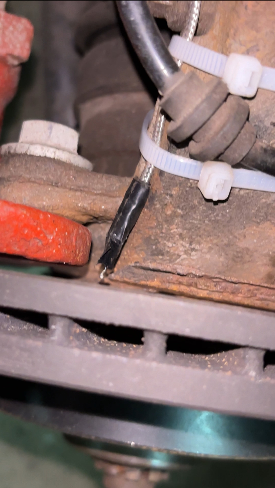
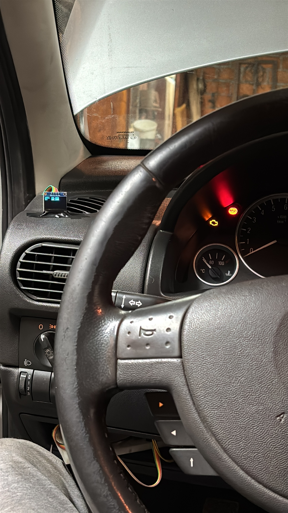
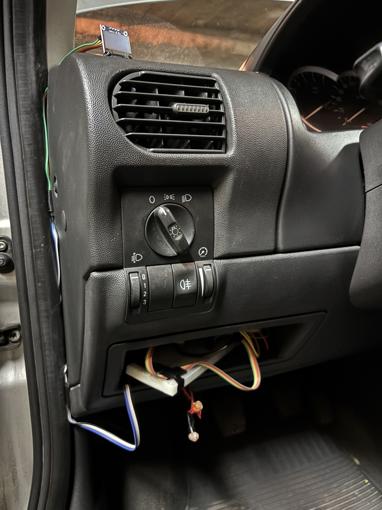

# 🧩 Brake Temperature Sensor System (BTSS)

An embedded system that monitors **brake disc temperature** using a **Raspberry Pi Pico** and **K-type thermocouple (MAX6675)**.  
The project aims to log and analyze brake temperatures and eventually correlate them with driving behavior via **OBD2 data**.

---

## 🚗 Current Development Snapshot — 2025-10-31

The first **live vehicle test** was completed using a single thermocouple mounted next to the **left front caliper bracket** on the **steering knuckle**, approximately **3 mm from the brake disc**.  
This prototype operated **without Wi-Fi streaming**, displaying real-time temperature from one sensor on the **SSD1306 OLED** inside the cabin.

  
  
  

**Observation:**  
During several 100 → 0 km/h braking tests (ABS active, ambient ≈ 3 °C) readings reached only ~20 °C, confirming significant **thermal lag** due to the sensor’s distance from the disc.

Future plans (if the sensor is repositioned closer, ~1 mm from the disc):

- If a significant temperature improvement is observed, continue testing and potentially connect a second sensor for comparison.
- If no meaningful improvement, the project will be paused for the time being.
- In the future, **infrared sensing** could be explored for non-contact measurement, common in performance vehicles.

---

## ⚙️ System Overview

The Raspberry Pi Pico has **three main connections**:

1. **OLED Display (Output):**

   - SSD1306 OLED connected via jumper wires from Pico.
   - Jumper wires extended and secured with insulating tape to position the OLED near the dashboard for visibility.
   - OLED and breadboard temporarily mounted in the **small glove box left of the steering wheel** for debugging.

2. **Sensor Inputs (Thermocouples):**

   - Thermocouple (~48 cm cable) → MAX6675 module → 5 fast-connector wires → Pico GPIO pins.
   - Sensor mounted on the **steering knuckle** using zip ties for stability.

3. **Power:**
   - Pico powered via Micro-USB → USB-A cable from **DC buck converter (6–24 V → 5 V, 3 A)**.
   - Buck converter input fed from **12 V noise filter**, which receives:
     - +12 V from **Fuse F29 (20 A, windshield-washer circuit)** via **Add-a-Fuse (5 A)**
     - GND from **M6 chassis bolt**.

---

## 🔧 Software Components

| File      | Description                                                                         |
| --------- | ----------------------------------------------------------------------------------- |
| `main.py` | Pico firmware used in car test — reads single thermocouple and shows value on OLED. |

---

## 🧠 Project Status

- Prototype fully installed and tested in vehicle.
- Thermal lag observed due to sensor distance; repositioning or IR sensing could improve accuracy.
- Project currently **paused** unless significant improvement is observed from sensor repositioning.

---

## 🗂 Related Documentation

- `HARDWARE_LOG.md` — chronological wiring and installation notes
- `README.md` — project overview and current test status

---

### 🏷️ Tag: `install-test-2025-10-31`

Marks the first live vehicle test and complete wiring integration.
